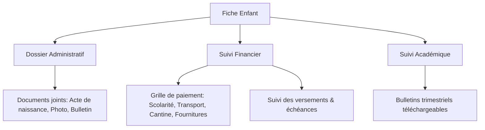
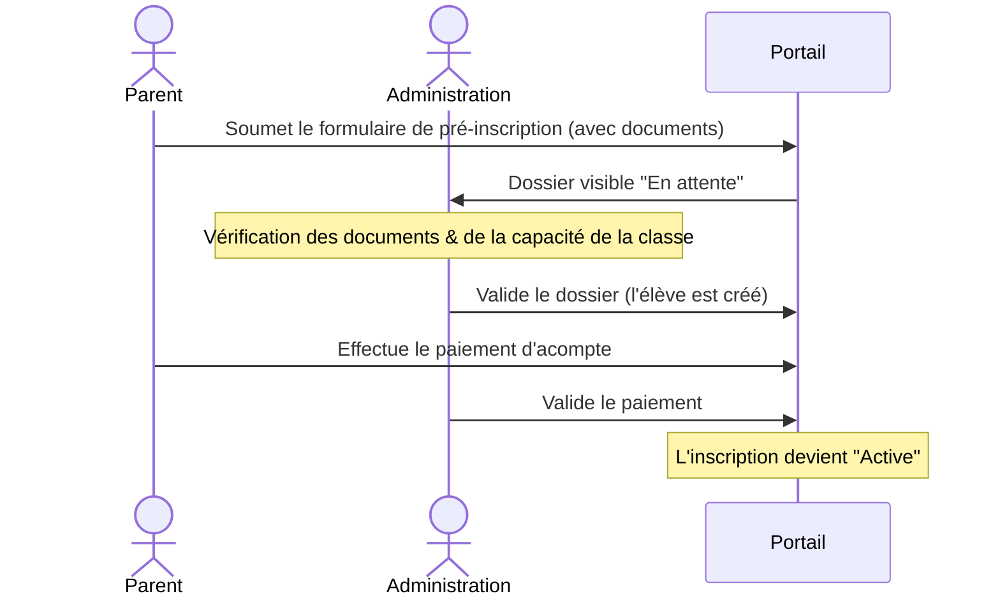

# Guide d'Utilisation - Application E.I.E.F
Ce guide détaille les fonctionnalités et les workflows de la plateforme de gestion scolaire de l'**École Internationale des Enfants Futur (E.I.E.F)**.

---

## 🗺️ Présentation Générale
L'application E.I.E.F est une plateforme web moderne conçue pour numériser et simplifier la relation entre l'école, les parents et l'administration scolaire. Elle s'organise autour de trois grands espaces :

1. **Le Portail Public (Visiteurs)** : Pour les informations générales et les demandes d'inscription initiale.
2. **L'Espace Parent** : Pour le suivi scolaire (bulletins, absences) et financier (paiements, échéances) des enfants.
3. **L'Espace Administration (Directeur des Études / Comptabilité / Direction)** : Pour la validation des dossiers, la gestion académique et le suivi budgétaire de l'établissement.

---

## 👤 1. Guide de l'Espace Parent

L'espace parent est le point d'accès unique pour les tuteurs afin de suivre la scolarité et de gérer les frais scolaires.

### 📊 Le Tableau de Bord (Accueil)
Dès la connexion, le parent accède à une vue d'ensemble :
* **Effectifs** : Nombre d'enfants actuellement inscrits ou en cours de traitement.
* **Finances globales** :
  * **Montant à payer** : Somme consolidée de la scolarité de base et des services optionnels (cantine, transport, fournitures) pour tous ses enfants.
  * **Montant payé** : Total des versements validés par l'école.
  * **Solde restant** : Somme restant à régler.
* **Mes enfants inscrits** : Liste des dossiers de pré-inscription/réinscription avec badges de statut de traitement et statut financier.

### 👶 Section "Mes Enfants"
Cette page permet un suivi individuel détaillé pour chaque enfant.

#### 🔍 Détail de l'Élève (Modal)
En cliquant sur l'icône de l'œil (Actions), une fenêtre s'ouvre avec plusieurs onglets :
* **Informations Personnelles** : Filiation complète (Coordonnées du père, de la mère, email, téléphone, profession).
* **Documents joints** : Liens directs pour visualiser l'acte de naissance, la photo d'identité et le bulletin d'origine transmis.
* **Détail des paiements** :
  * Un récapitulatif financier complet (Total, Déjà payé, Reste, Statut, Barre de progression).
* **Bulletins & Notes** :
  * Accès à l'historique des notes et téléchargement des bulletins scolaires trimestriels au format PDF.

### 📝 Inscription & Réinscription
* **Inscription** : Formulaire interactif en ligne pour saisir les informations d'un nouvel enfant, choisir les services optionnels (cantine, transport), commander des fournitures et téléverser les justificatifs requis.
* **Réinscription** : Permet de reconduire un élève déjà inscrit vers la classe supérieure avec mise à jour automatique de son dossier financier pour la nouvelle année.

### 💳 Espace Finances & Plan de Paiement
* **Demande de Paiement** : Les parents peuvent déclarer un versement en ligne en joignant un justificatif de paiement (virement, dépôt, paiement mobile).
* **Échéances de Paiement** : Suivi rigoureux des échéanciers de paiement définis avec l'administration.

---

## ⚙️ 2. Guide de l'Espace Administration (Directeur des Études / Comptables)

Cet espace est destiné au personnel interne de l'école pour superviser le bon fonctionnement de l'établissement.

### 📈 Statistiques Générales et Financières
La direction bénéficie d'un tableau de bord de pilotage en temps réel :
* **Général** : Nombre total d'élèves (hommes/femmes), d'enseignants, de classes actives et de comptes parents.
* **Comptabilité** :
  * **Recettes** : Totalité des paiements validés.
  * **Dépenses** : Somme des salaires du personnel payés et des autres dépenses opérationnelles validées.
  * **Trésorerie / Solde** : Différence nette entre recettes et dépenses (`Recettes - Dépenses`).
  * **Taux de recouvrement** : Pourcentage des frais scolaires effectivement collectés par rapport aux frais totaux facturés.

### 📂 Gestion des Dossiers et Validation
* **Validation des pré-inscriptions** : Examen des dossiers saisis par les parents, validation de l'attribution des classes ou rejet motivé.
* **Validation des paiements** : La comptabilité vérifie les reçus téléversés par les parents et valide les transactions pour mettre à jour instantanément les soldes des élèves.

### 🏫 Gestion Académique
* **Classes & Matières** : Configuration des niveaux, attribution des enseignants titulaires aux classes et gestion des coefficients.
* **Bulletins & Notes** : Saisie des notes par matière et génération automatique des bulletins PDF à la fin de chaque période d'évaluation.

---

## 🔄 3. Workflows Clés de l'Application

### A. Workflow d'Inscription d'un Élève

### B. Workflow d'un Paiement et Suivi Financier
1. **Émission** : Lors de l'inscription/réinscription, un plan financier est généré pour l'élève (Scolarité + Cantine + Transport + Fournitures).
2. **Déclaration** : Le parent effectue un versement (ex: 100 000 GNF) et le soumet dans l'application avec la référence ou une capture du reçu.
3. **Approbation** : Le comptable valide la transaction.
4. **Mise à jour** : 
   * Le statut de paiement passe à **Partiel** ou **Payé**.
   * Le solde restant diminue.
   * La barre de progression financière se met à jour sur le tableau de bord parent.

---

## 🛠️ Diagnostics PWA (Installation Mobile)

L'application prend en charge le format **PWA (Progressive Web App)** pour être installée comme une application native.

> [!NOTE]
> **Compatibilité Android vs iOS**
> * **Sur Android (Chrome)** : L'application détecte automatiquement la compatibilité et affiche un pop-up interactif permettant d'installer l'application en 1 clic.
> * **Sur iOS (Safari)** : Pour des raisons de restriction Apple, aucun pop-up automatique ne peut s'afficher. L'utilisateur doit appuyer manuellement sur l'icône de partage 📤 puis faire défiler pour choisir **"Sur l'écran d'accueil"**.
